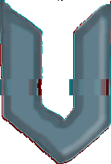

<p align="center">
</p>

<p align="center"><h1 align="center">Utopia Beta</h1></p>

<p align="center">Is a revolutionary pr‍o‍x‍‍y network that can u‍‍n‍b‍‍l‍o‍‍c‍‍k nearly any website. You can use this proxy network anywhere to browse the in‍te‍‍rn‍‍et fr‍ee‍ly without having to worry about any web restrictions such as internet cencorship or website blockers.</p>

## Features
- Ultraviolet, Rammerhead, and Womginx
- CAPTCHA support along with hCAPTCHA support
- URL encoding settings to further hide activity when using Utopia Beta
- Configuration all done on the client-side via service-workers or WomPass
- Speed in comparison to other web proxies networks that fully proxy content
- Blacklist setting and more for easy hosting
- Security in mind and leak prevention
- Frequent updates to improve site support or fix security issues

## Technologies Used
- Ultraviolet
  - Service Workers
  - HTML, JS, CSS rewriting
  - Parse5
  - Acorn.js
- Rammerhead
  - Service Workers
  - HTML, JS, CSS rewriting
  - Parse5
  - Acorn.js
  - BrowserUI
- Womginx
  - HTML, JS, CSS rewriting
  - Parse5
  - Acorn.js
  - WomPass

## Table of Contents
- [Installation And Setup](#installation-and-setup)
  - [Basic Guide](#basic-guide)
  - [Replit Setup Guide](#replit-setup-guide)
- [Author](#author)

# Installation and Setup

Installation of Utopia is simple. You can find a Tl;DR of the installation and setup process just below. If you are unfamiliar with the "standard" installation process, look a bit farther down for a more comprehensive installation and setup guide.

## Basic Guide

```sh
$ git clone https://github.com/DK0K322/Utopia --recursive
$ cd Ultraviolet-Node
$ npm install
$ npm start
```

## Replit Setup Guide
[](https://replit.com/github/DK0K322/Utopia)
To setup on Replit, first click on the "Run on Replit" button. After loading into your repl, click on the green "Run" button. Alternatively, run the following commands:

```sh
$ npm install
$ chmod +x main.sh
$ ./main.sh
```

You will only have to run the second command once. It just allows `main.sh` to be executed. By running `main.sh`, you will update any submodules and will start the app.

**Note**: If you choose not to use `main.sh`, but would rather just run all commands manually, please note that you will have to manually install submodules by running `git update submodules --init`. Without it, `static` will not be installed, and that is a required directory.

# Author

Doğukan Koç (Creator of Utopia ID and Utopia Beta, Ultraviolet, Rammerhead, and Womginx.)

#

*©2022 Doğukan Koç*

